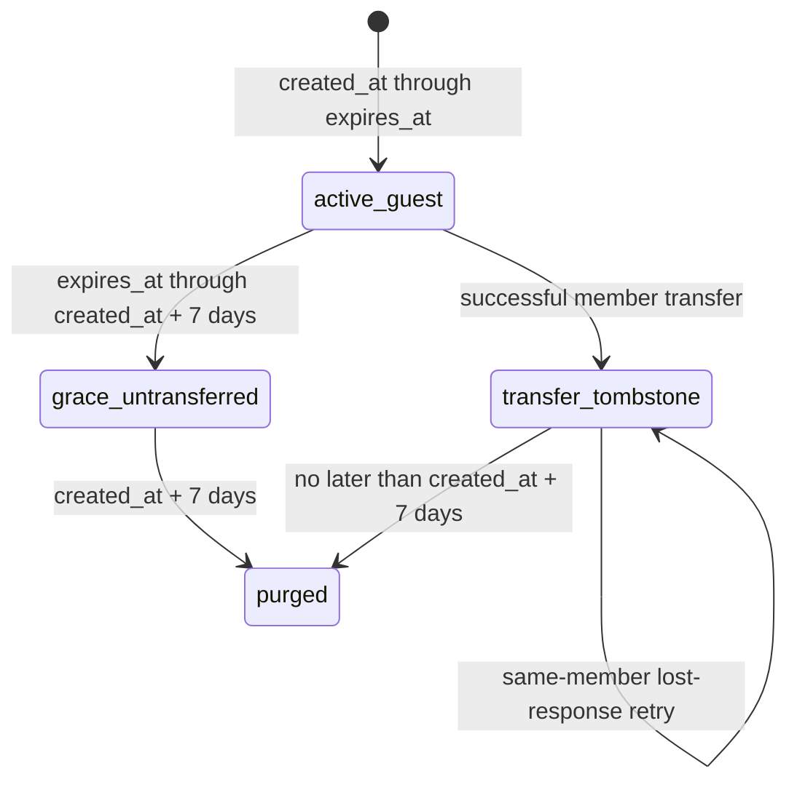

# STEP 52D-1A - Guest Retention and Cleanup Design

## 1. Executive Verdict

**Verdict: PASS.** The current guest model is understood sufficiently to begin a small, dependency-safe implementation. The recommended implementation is a bounded, server-only cleanup worker plus a minimal transferred-row tombstone state. It preserves the existing 24-hour guest access and transfer contract, avoids new customer-triggered cleanup, and does not change commerce behavior.

**Baseline:** `e76655c9c9ff2d85ab2c01b41103ca03e8a20d5b`
**Files changed by this step:** this document only.

The critical constraint is transfer retry: the transfer RPC authenticates the guest row with its hash before it can return `already_transferred`. Therefore immediate deletion or hash clearing on transfer would make a successful transfer with a lost HTTP response non-idempotent for the customer.

## 2. Current Guest Architecture

| Concern | Authoritative location | Current behavior |
| --- | --- | --- |
| Table and transfer RPC | `supabase/migrations/010_guest_free_analyses.sql`, `supabase/migrations/012_guest_transfer_rpc_fingerprint_signature.sql` | Stores guest input/content and transfers it into member profile/free-analysis records. |
| Guest creation/read | `app/api/guest-free-analysis/route.ts`, `app/lib/guestFreeAnalyses/server.ts` | Creates a random credential, persists only its SHA-256 hash, and checks hash plus row state. |
| Guest credential | `app/lib/guestFreeAnalyses/cookie.ts` | HttpOnly, SameSite Lax, production-secure cookie; 24-hour max age. |
| Transfer endpoint | `app/api/guest-free-analysis/transfer/route.ts` | Requires authenticated member and matching guest cookie credential. |
| Transfer database operation | `public.complete_guest_analysis_transfer(...)` | Locks guest row, validates secret hash/status/expiry, creates or finds member profile, creates/updates member result, marks guest row consumed/transferred. |
| Current expiry enforcement | `isUsableGuestFreeAnalysis()` and guest API routes | Requires not consumed and `expires_at > now()` for ordinary guest access/transfer. |
| Cleanup/scheduler | `app/api/internal/reconcile/route.ts` | No guest cleanup worker exists. |
| Existing regression surface | `scripts/guest-free-analysis-server-regression.ts`, `scripts/guest-free-analysis-transfer-regression.ts`, `scripts/guest-free-analysis-revisit-regression.ts`, `scripts/guest-ui-integration-regression.ts` | Covers guest creation, transfer, revisit, cookie ownership, and UI paths; no retention cleanup coverage exists. |

## 3. `guest_free_analyses` Field Classification

| Column | Purpose | Personal / credential data | Needed before 24h | Needed 24h to 7d | Needed after transfer | Idempotency / integrity need | Target behavior |
| --- | --- | --- | --- | --- | --- | --- | --- |
| `id` | Guest analysis identity | Identifier | Yes | Yes | Yes, while tombstone exists | Required to locate retry row | Retain in tombstone; delete with row at cleanup boundary. |
| `secret_hash` | Credential verifier | Security material | Yes | Yes while unexpired; not for expired ordinary access | Yes for a bounded lost-response retry | Required by current RPC before `already_transferred` branch | Retain only in bounded tombstone; remove by hard deletion at deadline. |
| `status` | Generation lifecycle | Technical metadata | Yes | Potentially for pre-expiry retry/recovery | Not needed after successful transfer except minimum tombstone state | Current RPC requires completed before first transfer | Set a dedicated minimized/transferred state or preserve consumed marker only; delete at deadline. |
| `profile_input` | Guest label/relationship/saju input | Personal data | Yes | Only while valid guest result/transfer/retry needs it | No | Not needed by already-transferred response | Null/scrub atomically on successful transfer; purge untransferred by day 7. |
| `profile_fingerprint` | Input consistency check | Derived personal data | Yes | Needed for valid first transfer | No after successful transfer | Required by current RPC before it commits first transfer | Null/scrub after successful transfer; purge untransferred by day 7. |
| `content` | Guest free result | Personalized content | Yes | Needed for valid first transfer/recovery | No after member copy is authoritative | Required to create member free result on first transfer | Null/scrub after successful transfer; purge untransferred by day 7. |
| `selected_product_id` | Guest selected product transfer context | Product metadata, not direct personal data | Yes | Needed for successful/lost-response transfer response | Yes, if retained response semantics require it | Current `already_transferred` returns it | Retain only if retry response must reproduce it; otherwise remove after client contract review. |
| `created_at` | Retention anchor | Technical metadata | Yes | Yes | Yes | Required for seven-day absolute deadline | Retain until row deletion. |
| `updated_at` | Operational ordering | Technical metadata | Yes | Yes | Optional | Not a retention anchor | Retain until row deletion; never use as cleanup deadline. |
| `expires_at` | 24-hour access/transfer boundary | Technical metadata | Yes | Yes | Optional | Required by first transfer and access validation | Retain until row deletion. |
| `consumed_at` | First transfer marker | Transfer metadata | No | No | Yes | Required to distinguish an already-transferred retry from a cross-user claim | Retain in tombstone. |
| `transferred_user_id` | Transferred member linkage | Account identifier | No | No | Yes | Required to allow only the same member to receive `already_transferred` | Retain in tombstone; use for later member closure cleanup. |
| `resolved_profile_id` | Resolved member profile linkage | Profile identifier | No | No | Yes | Required by current idempotent transfer result | Retain in tombstone; use for later closure cleanup. |

## 4. Current Lifecycle State Machine

```mermaid
stateDiagram-v2
  [*] --> generating: guest creates analysis
  generating --> completed: generation succeeds
  generating --> failed: generation fails
  completed --> accessible: matching cookie, before expires_at
  accessible --> expired: expires_at passes
  accessible --> transferred: member transfer succeeds
  transferred --> transferred: same member retries with same credential
  transferred --> rejected: different member retries
  expired --> [*]: current code only denies access; row remains
```

Current implementation has no physical terminal cleanup state. Cookie expiry only ends browser authorization and ordinary API access; it does not delete, scrub, or purge the row.

## 5. Frozen Target Lifecycle

- Customer access and supported initial transfer remain limited to `expires_at`, currently created server-side as creation time plus 24 hours.
- The maximum backend deadline is `created_at + interval '7 days'`, never `updated_at + interval`.
- After successful transfer, raw guest personal input, content, fingerprint, and raw credential material are removed in the same transaction; only a bounded idempotency tombstone remains.

## 6. Transfer Idempotency Analysis

1. **Guest authorization:** The browser presents the guest credential. The API hashes its secret; the RPC requires `id` and exact `secret_hash` match under `FOR UPDATE`.
2. **Cross-user claim prevention:** The RPC locks one guest row. Once consumed, it returns `already_transferred` only when `transferred_user_id = p_user_id`; a different member receives `GUEST_ANALYSIS_ALREADY_CONSUMED`.
3. **Double-transfer prevention:** `consumed_at` blocks a second first-transfer operation. Member free-result lookup is also locked.
4. **Lost response retry:** The same authenticated member plus the same still-present hash receives the stored `resolved_profile_id` and selected-product context without copying data again.
5. **First transfer needs:** `profile_input`, `profile_fingerprint`, `content`, `secret_hash`, status `completed`, a future `expires_at`, and the member user ID. `transferred_user_id`, `resolved_profile_id`, and `consumed_at` are written as the result.
6. **Post-transfer retry needs:** Current behavior needs guest ID, `secret_hash`, `consumed_at`, `transferred_user_id`, `resolved_profile_id`, and potentially `selected_product_id`. It does not need input, fingerprint, content, or generation status.
7. **Atomic minimization:** Yes. The same transfer RPC transaction can write the member copy and then update the guest row with consumed/transfer linkage while setting raw personal fields to null. The current schema requires non-null `profile_input`, `profile_fingerprint`, and `secret_hash`, so nullable-column changes or a separate tombstone table are required first.
8. **Safest fallback:** If same-transaction schema evolution cannot be deployed safely, use an explicit `transferred_minimized_at` marker and a second server-only transaction conditioned on successful transfer linkage. Do not expose the intermediate state to browser clients. This has more crash-recovery complexity than atomic minimization.
9. **Immediate hash scrubbing:** Yes, it breaks the current lost-response retry because hash comparison happens before the `already_transferred` branch.
10. **Bounded retry design:** Retain the hash only inside the transfer tombstone until the absolute seven-day-from-creation cleanup deadline. At that deadline hard-delete the tombstone. The API should continue using the same hash/session path; no new cross-user recovery path is created.

## 7. Recommended Transferred-Row Cleanup Design

**Recommendation: Option C - minimized transfer tombstone followed by hard deletion.**

Retain a single existing `guest_free_analyses` row, but immediately after successful transfer atomically:
- retain `id`, `secret_hash`, `selected_product_id` only if response compatibility requires it, `created_at`, `updated_at`, `expires_at`, `consumed_at`, `transferred_user_id`, and `resolved_profile_id`;
- clear `profile_input`, `profile_fingerprint`, and `content`;
- record `transferred_minimized_at` or an equivalent bounded marker;
- prevent any normal guest read/retry generation path from treating the tombstone as an active guest analysis.

Why not immediate row delete: the current idempotent `already_transferred` result needs the authenticated caller, member linkage, and resolved profile linkage after a lost response. Why not indefinite tombstone: the seven-day retention policy forbids indefinite credential material retention.

Foreign-key consequences: `resolved_profile_id` and `transferred_user_id` currently point from the guest row outward. Deleting the guest row at the deadline does not break member records. Member closure can identify and remove the tombstone through `transferred_user_id` before or during finalization.

Observability: cleanup logs must use aggregate counters and category/outcome only; never log guest ID, hash, profile input, or content.

## 8. Recommended Expired/Untransferred Cleanup Design

**Recommendation: hard-delete the full row at `created_at + 7 days`.**

There is no member/history table that references `guest_free_analyses.id`; the table's own links point to member records only after transfer. Expired untransferred rows cannot be read, transferred, selected, or retried through ordinary application paths. No technical requirement was found to keep their `selected_product_id`, status, timestamps, input, content, fingerprint, or hash after the seven-day deadline.

A hard delete minimizes the entire personal and credential surface. A scrub tombstone offers debugging convenience only; no current technical integrity or idempotency need justifies retaining it after the frozen maximum retention period.

## 9. Scheduler and Execution Design

**Recommendation: Option 1 - add a bounded guest cleanup worker to the existing shared authenticated scheduler.**

The existing dispatcher is `app/api/internal/reconcile/route.ts`, protected by the existing server-only `isAuthorizedSchedulerRequest()` helper. It already invokes independent payment, refund, and account-closure workers with isolated results.

A guest worker should:
- be a server-only direct function, not a browser/API customer action;
- claim a bounded batch with a short expiring lease using a database RPC and `FOR UPDATE SKIP LOCKED`;
- process each claimed row independently so one malformed row records a safe failure and does not poison the batch;
- report counts only: claimed, deleted, minimized, skipped, retry-pending, failed;
- run after payment/refund/closure workers because it is non-financial and should not delay them;
- have isolated dispatcher failure semantics: a guest worker failure is visible in aggregate status but does not prevent later workers.

A dedicated endpoint would duplicate scheduler authentication and monitoring surface without a stronger dependency reason.

## 10. Exact Time Predicates

| Situation | Authoritative predicate |
| --- | --- |
| Valid guest access | `consumed_at is null AND expires_at > database/server now()` plus credential match and completed current result. |
| Initial transfer | Same as valid access, with completed content and fingerprint match. |
| Expired untransferred cleanup | `consumed_at is null AND created_at <= now() - interval '7 days'`. |
| Transferred tombstone cleanup | `consumed_at is not null AND created_at <= now() - interval '7 days'`. |
| Post-transfer minimization | `consumed_at is not null AND transferred_minimized_at is null`, immediately after transfer or reclaimed after a short lease. |

Use database/server time, not browser time. Do not use `updated_at` for expiry because retries or maintenance could extend retention beyond seven days from creation.

## 11. Race and Concurrency Matrix

| Race | Risk | Required guard / result |
| --- | --- | --- |
| Transfer and cleanup select same row | Cleanup could remove valid transfer input. | Both use row claim/lock. Cleanup predicate must exclude rows not yet past `created_at + 7 days`; transfer requires pre-24h `expires_at`. Transfer wins before expiry; cleanup only becomes eligible much later. |
| Read at 24h boundary | Clock ambiguity. | Existing database/server `expires_at > now()` remains authoritative; boundary access is rejected. |
| Transfer succeeds while cleanup runs | Personal data could be mishandled. | Atomic transfer minimization under row lock; later cleanup sees tombstone only. |
| Two cleanup runs | Duplicate delete/minimize. | Claim token, lease expiry, `SKIP LOCKED`, and conditional predicates. Second worker skips or sees no row. |
| Worker crash after claim | Row may remain locked logically. | Expiring claim lease allows later safe reclaim; no permanent claim. |
| One row fails in batch | Batch could stop. | Per-row error isolation, safe failure counter, continue bounded batch. |
| Lost transfer response | Client retries after commit. | Same credential hash plus matching transferred member returns `already_transferred`; raw input/content already minimized. |
| Signup near expiry | Transfer before/after 24h must be deterministic. | RPC uses database `expires_at`; before succeeds, after returns expired. No browser clock. |
| Partially minimized transferred row | Retry must not try first-transfer logic. | Explicit tombstone marker plus `consumed_at` branch before accesses to scrubbed personal columns. |

## 12. Schema and Migration Recommendation

A migration is required because current `profile_input`, `profile_fingerprint`, and `secret_hash` are non-null and cannot be atomically scrubbed in-place.

Smallest robust approach:
1. Make the three personal/security columns nullable only for consumed tombstone rows, while preserving non-null validation for active unconsumed rows using a check constraint.
2. Add `transferred_minimized_at timestamptz` and cleanup claim/lease fields to `guest_free_analyses`: claim token, claimed time, claim expiry, and optionally a safe error code/attempt count only if existing scheduler conventions require retry visibility.
3. Add a partial claimable index keyed by `created_at`, consumption/minimization state, and expired claim lease.
4. Replace the transfer RPC so it copies member data, writes transfer linkage, and clears personal guest columns atomically before returning.
5. Add a service-role-only claim/cleanup RPC. It must hard-delete rows at the absolute seven-day deadline and never accept browser-supplied user, guest, or retention timestamps.

Backfill plan:
- rows already older than seven days and unconsumed: eligible for hard delete;
- transferred rows still containing personal data: minimize then delete no later than their original creation deadline;
- incomplete/failed rows: hard delete at the same absolute deadline;
- malformed legacy rows: claim safely by age, avoid logging raw values, and hard delete if no active transfer prerequisite remains;
- rows with unexpected null/status state: treat as cleanup-safe only after a strict conditional review; otherwise record a safe failure and leave for owner investigation.

Rollback: additive nullable/marker/lease columns can remain harmlessly if worker rollout is rolled back; no customer access behavior should accept a minimized row as active.

## 13. Security and Privacy Constraints

- Never log profile input, generated content, secret hash, raw credential, email, birth data, or payment/refund data.
- Cleanup is service-role/server-only and scheduler-authenticated; no customer endpoint, query parameter, or client action can trigger it.
- Browser code never receives service-role access.
- A minimized row cannot reconstruct original saju input or generated result.
- Cleanup cannot grant entitlements or mutate payment, refund, account eligibility, or paid-report behavior.
- Preserve existing transfer authorization: the original matching credential and authenticated matching member are required for idempotent retry.

## 14. Test and Regression Plan

| Scenario | Test level |
| --- | --- |
| Valid <24h guest result remains readable | Existing route/integration regression plus local DB test. |
| Guest read/transfer fails after expiry | Existing guest revisit/transfer regression plus local DB boundary test. |
| Valid transfer within 24h | Existing transfer regression plus upgraded DB proof. |
| Wrong secret or wrong member denied | Existing transfer regression. |
| Member copy remains correct after transfer | Local DB integration test. |
| Transfer atomically minimizes guest personal fields | New local DB integration test. |
| Lost-response retry succeeds from tombstone | New local DB integration test. |
| Expired untransferred survives grace but is gone/scrubbed by day 7 | New time-controlled local DB integration test. |
| Cleanup leaves valid <7d rows and member copy untouched | New local DB integration test. |
| Concurrent cleanup / cleanup-transfer race | New claim/lease concurrency test. |
| Malformed row does not log personal data or poison batch | New worker unit/regression test. |
| Scheduler authentication and payment/refund/closure remain unchanged | Extend shared-dispatcher regression. |

## 15. Expected 52D-1B File Plan

Expected minimum changes, subject to final schema review:
- one additive migration after `034` for guest tombstone/claim fields, constraints, indexes, transfer RPC replacement, and service-role cleanup claim/delete RPC;
- `app/lib/guestFreeAnalyses/server.ts` for the canonical bounded cleanup worker only;
- `app/api/internal/reconcile/route.ts` to invoke that worker with isolated aggregate counts;
- existing guest transfer route/service only if its response must distinguish an already-transferred minimized tombstone;
- focused static/scheduler regression plus local disposable-Supabase integration regression.

No customer UI, payment, refund, entitlement, adult eligibility, or Admin write control is required for the smallest slice.

## 16. Risks and Unresolved Questions

### Owner decision required

- Whether `selected_product_id` must remain in the temporary transfer tombstone for lost-response UX, or whether `resolved_profile_id` alone is sufficient.
- Whether the seven-day absolute deadline applies unchanged to transferred tombstones; this design recommends yes, consistent with the frozen maximum guest backend retention.

### Legal decision required

- Confirm the seven-day grace period and any lawful need to retain a minimal transfer/audit record beyond it.
- Confirm whether hashed guest credential material requires separate privacy disclosure language during the bounded tombstone window.

### Technical detail to resolve in implementation

- Exact active-row check constraint syntax for nullable personal fields after transfer.
- Whether a minimal safe failure counter is necessary or aggregate scheduler observability is sufficient.
- Deployment verification that migration history and the guest transfer RPC signature are aligned in each environment.

## 17. Final Recommendation for STEP 52D-1B

Implement the smallest safe slice: an additive guest-row tombstone/claim migration, atomic post-transfer minimization, a bounded server-only shared-scheduler cleanup worker, and local DB concurrency/retention proofs. Retain only the hash and transfer linkage needed for current lost-response idempotency, then hard-delete every guest row no later than seven days from `created_at`.
